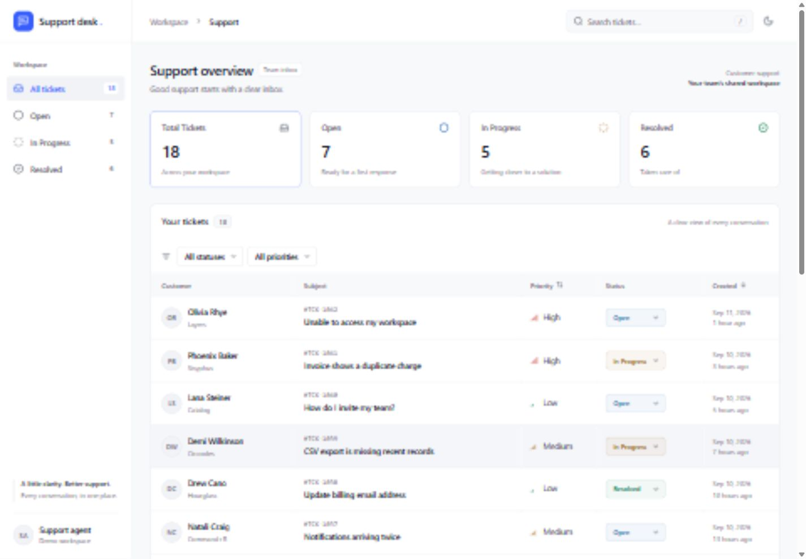
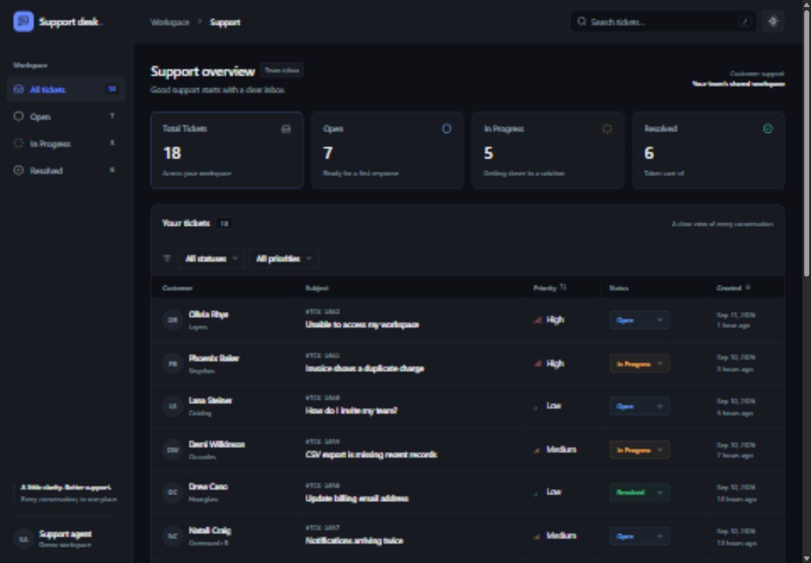
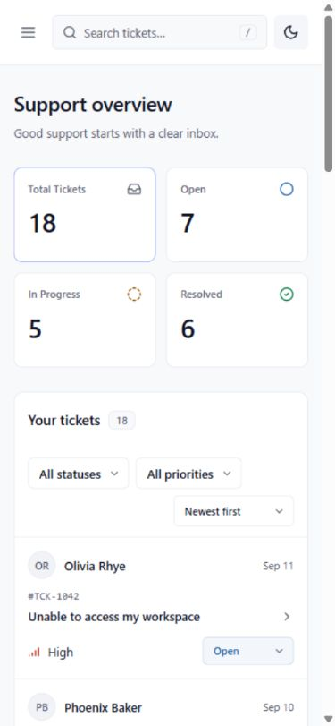
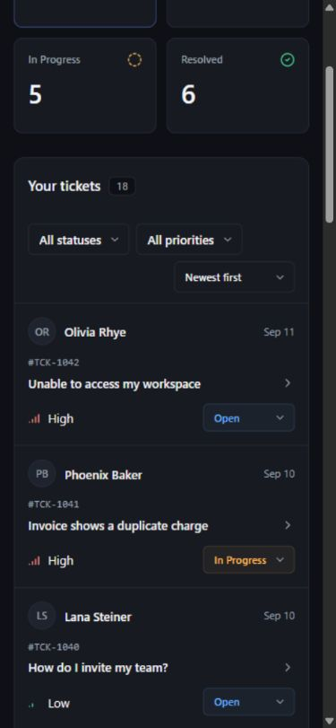

# Customer Support Dashboard

A focused support workspace for searching, prioritizing, and resolving customer tickets, built with React 18, TypeScript, Tailwind CSS, and Zustand.

**Repository:** [Cold-Juice911/customer-support-dashboard](https://github.com/Cold-Juice911/customer-support-dashboard)

**Live demo:** Deployment is intentionally reserved for the repository owner. Add your Vercel URL here after publishing. The project is ready to import into Vercel; no environment variables are needed.



<details>
<summary>Dark mode and mobile screenshots</summary>






</details>

## Features

- [x] Live Total Tickets, Open, In Progress, and Resolved statistics derived from the same ticket state.
- [x] Customer names, subjects, ticket IDs, priorities, statuses, and created dates.
- [x] Search by customer, subject, or ticket ID with a 275 ms debounce.
- [x] Independent status and priority filters that combine with search.
- [x] Inline status changes and editable status/priority in ticket details.
- [x] Desktop slide-over and mobile full-screen detail sheet with customer information, issue details, dates, and chronological messages.
- [x] Mark Resolved and Reopen ticket actions, with accessible confirmation notifications.
- [x] A mock API with 18 realistic tickets, a 750 ms delay, and multi-message conversations.
- [x] Distinct loading skeletons, retryable errors, empty workspace, and empty search results.
- [x] Desktop sidebar, mobile/tablet navigation drawer, and stacked mobile ticket cards.
- [x] Light/dark themes, initial system preference, and saved theme/filter choices.
- [x] Keyboard access, visible focus, dialog focus wrapping, Escape dismissal, and focus restoration.
- [x] `/` search shortcut, sortable created date and priority, and reduced-motion support.
- [x] Strict TypeScript, ESLint, Prettier, unit tests, and GitHub Actions checks.

## Tech stack

| Layer     | Technology                                |
| --------- | ----------------------------------------- |
| UI        | React 18, TypeScript in strict mode       |
| Build     | Vite                                      |
| Styling   | Tailwind CSS 3, CSS-variable theme tokens |
| State     | Zustand 5 with derived selectors          |
| Icons     | Lucide React                              |
| Utilities | date-fns, clsx, tailwind-merge            |
| Quality   | Vitest, ESLint, Prettier                  |

The lockfile pins the complete dependency tree. No visual component library or external data service is required.

## Getting started

Use Node.js **22.12 or newer**. Node 22 is recorded in `.nvmrc` and used by CI. npm is included with Node.

```bash
git clone https://github.com/Cold-Juice911/customer-support-dashboard.git
cd customer-support-dashboard
npm ci
npm run dev
```

Open the local URL printed by Vite, normally `http://127.0.0.1:5173`.

```bash
# Run lint, formatting checks, tests, and the production build
npm run check

# Individual commands
npm test
npm run lint
npm run format:check
npm run format
npm run build

# Serve the production build locally
npm run preview
```

The production output is written to `dist/`. GitHub Actions runs `npm ci` and `npm run check` on pushes to `main` and pull requests. It does not deploy or create commits.

## Deploying to Vercel

1. Import `Cold-Juice911/customer-support-dashboard` into your Vercel account.
2. Select the Vite framework preset and keep the repository root as the root directory.
3. Use `npm run build` as the build command and `dist` as the output directory; both are also declared in `vercel.json`.
4. Choose Node 22 or a newer supported Node version. No environment variables or API keys are required.
5. Deploy and add the resulting URL to the Live demo field above.

See [Vercel's Vite documentation](https://vercel.com/docs/frameworks/frontend/vite). There are no client-side routes, so no rewrite rules are needed.

## Folder structure

```text
src/
  components/
    ui/          Reusable buttons, selects, avatars, skeletons, and notifications
    layout/      Sidebar, topbar, theme toggle, and demo controls
    tickets/     Statistics, filters, lists, badges, and ticket details
  hooks/         Debounce and dialog lifecycle/focus behavior
  lib/           Shared types, seeded data, mock API, preferences, and utilities
  store/         Ticket store, selectors, and unit tests
  styles/        Tailwind layers and light/dark theme tokens
docs/
  screenshots/  Actual desktop and mobile captures
  VERIFICATION.md
```

## State management

Zustand keeps shared ticket behavior in one small store without provider or reducer boilerplate. Components subscribe only to the state or actions they use.

`ticketStore.ts` owns:

- Tickets and the request lifecycle (`idle`, `loading`, `success`, `error`).
- Search, status/priority filters, selection, sorting, and confirmation state.
- Fetch, filter, selection, status, and priority actions.

`filteredTickets` combines the three filters and sorts a new array; it never mutates the underlying dataset. `stats` counts the entire dataset, so filtering does not misleadingly change the workspace totals. Zustand's `useShallow` stabilizes derived arrays/objects for React 18.

Ticket selection stores an ID instead of a duplicate ticket object. The detail panel therefore reflects list edits immediately, even when a changed ticket leaves the active filter. Updates replace only the matching ticket and set `updatedAt`. Unknown IDs and unchanged values are safe no-ops. A request counter prevents older requests from replacing newer results.

Search text is held locally while typing and committed to the shared store after 275 ms. Clearing filters also resets the visible search input. Filter preferences are validated when read from browser storage, and blocked/corrupt storage falls back to usable defaults.

## Mock API and demo controls

`lib/api.ts` exposes an async `fetchTickets()` function. After 750 ms it returns 18 tickets from `lib/mockData.ts`. Ticket IDs and content are deterministic; timestamps are generated relative to fetch time so the demo stays useful. Customer email addresses use the reserved `.example` domain.

Expand **Demo controls** below the ticket list to exercise:

- **Simulate error:** shows loading, then an inline error without discarding existing tickets.
- **Retry:** fetches the normal sample dataset again.
- **Show empty workspace:** demonstrates a successful response with zero tickets.
- **Load sample tickets:** restores the original 18 tickets and their original statuses/priorities.

For a direct initial-state demonstration, open `/?demo=error` or `/?demo=empty`. The selected mode affects initial loading only; Retry always requests normal data. A search with no matches demonstrates the separate filtered-empty state and its Clear filters action.

## UI and accessibility decisions

The layout uses neutral surfaces, border separators, a restrained blue accent, and monospace ticket IDs. Semantic badge text uses darker light-theme and lighter dark-theme variants to preserve readable contrast. Dates display in the viewer's local timezone.

Below 640 px the table becomes a card list; at 640–1024 px navigation stays in a drawer; above 1024 px the sidebar remains visible. On compact tables, created dates appear below subjects, and a sort control provides the same options as desktop column headings.

Native modal dialogs make the background inert. Explicit Tab/Shift+Tab wrapping keeps focus within the active dialog; Escape and backdrop clicks close it. Closing restores focus to the opening subject, or to search if an edit removed that ticket from the current list. Notifications render inside the active ticket dialog so they remain in its accessible layer. Panel motion is 200 ms and disabled when reduced motion is requested.

## AI tools used

**OpenAI Codex** was used extensively to implement the application, write TypeScript types and Zustand logic, create the mock dataset, build the Tailwind interface, write tests and documentation, and perform tool-driven browser checks. Codex also assisted with repository setup and GPG-signed commits using the owner's configured signing key.

For a code walkthrough, begin with `lib/types.ts`, then `lib/api.ts` and `store/ticketStore.ts`, followed by `TicketList.tsx`, `TicketDetailPanel.tsx`, and `useDialog.ts`.

## Scope and limitations

All requested application features and the planned stretch features are implemented. Deployment is intentionally left to the repository owner.

- This is a frontend take-home demo with an in-process mock API, not an authenticated support service.
- Ticket edits last for the current page session. Reloading or loading sample tickets restores seeded data; theme and filters remain saved on this browser.
- Conversation history is read-only. Sending replies, uploading attachments, and real email delivery are outside the assignment scope.
- The small dataset is shown in full; pagination and virtualization are unnecessary for these 18 records.

See [verification notes](docs/VERIFICATION.md) for the checks performed.
